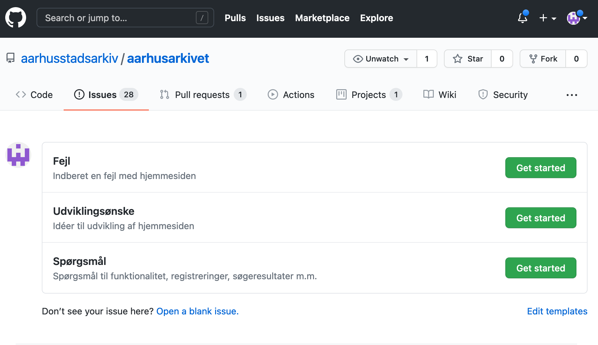

Aarhus Stadsarkiv bruger Github som udviklingsplatform. Det betyder, at kildekoden til de fleste af vores projekter ligger på Github, men det betyder også, at vi gerne vil have fejlmeldinger, udviklingsønsker m.m. til at ligge sammen med projekterne.

## Oprettelse af Github-konto
For at kunne fejlmelde problemer eller aflevere udviklingsønsker til de projekter, som medarbejderne benytter, skal du være oprettet som bruger af Github og knyttet stadsarkivets github-organisation.

Du kan [oprette dig som bruger her](https://www.github.com/join). Brugernavn og kode må du frit vælge, men du **skal** bruge din arbejdsmail(...@aarhus.dk).

Når du er oprettet som bruger, skal du meddele en fra it-teamet, at du gerne vil knyttes til Aarhus Stadsarkivs github-organisation. Vi kobler dig på organisationen, og du kan nu foretage indberetninger på de projekter, som stadsarkivet har liggende på github.

## Indberetninger
Indberetninger af fejl, udviklingsønsker, småændringer eller andet foregår ved at oprette såkaldte *issues* på Github-siden for det relevante projekt. Github har selv en udførlig dokumentation af, [hvordan man arbejder med "issues"](https://docs.github.com/en/github/managing-your-work-on-github/about-issues), men herunder er beskrevet de mest mest almindelige brugsscenarier, som medarbejderen vil møde.

!!!note "Bemærk"
    Det er ikke alle Stadsarkivets services og værktøjer, der har en Github-side. I disse tilfælde indberettes blot via mail.

!!! note "Bemærk"
    For at oprette issues, skal man som nævnt være oprettet som bruger af github. [Følg denne vejledning](../development/github.md#oprettelse-af-github-konto), hvis du ikke allerede er oprettet.

 Her er indledningsvis en liste med links til indberetningssider for de mest "populære" projekter:

- [AarhusArkivet](https://www.github.com/aarhusstadsarkiv/aarhusarkivet/issues/new/choose)
- [SAM](https://www.github.com/aarhusstadsarkiv/sam/issues/new/choose)
- [SAM-workflows](https://www.github.com/aarhusstadsarkiv/sam-workflows/issues/new/choose)
- [AarhusWiki](https://www.github.com/aarhusstadsarkiv/sam-workflows/issues/new/choose)

### Vælg indberetning
I de følgende afsnit vises nogle skærmbilleder fra forskellige projekters issue-sider. Disse er kun medtaget som eksempel, og de enkelte projekters sider kan se anderledes ud.

Når man står på et projekts issue-side, skal man klikke på "Get started" ud for det ønskede skabelon:

Der åbnes nu en ny side, som skal udfyldes med de relevante informationer, der knytter sig til denne specifikke skabelon. En fejlmeddelelse ser eksempelvis cirka sådan ud:

### Udfyld indberetning
Alle issues skal have en meningsfyldt titel, men herforuden vil der for de enkelte isssue-skabeloner være en række specifikke punkter, som man kan besvare. Ved fejlmeldinger vil vi eksempelvis gerne have beskrevet fejlen, samt angivet hvordan fejlen om muligt kan reproduceres.

!!! note "Bemærk"
    Tekstfeltet, hvori et issue skal beskrives, indeholder allerede noget template-tekst, hvis syntaks kan se lidt ukendt ud. Det hedder **markdown** og er bare en simpel måde, hvorpå man kan arbejde med basale formateringer (fed skrift, links, lister...).
    
    Hvis man er usikker på brugen heraf, benytter man bare den genkendelige værktøjslinje over feltet:

    

    Man kan eogså løbende se, hvordan ens issue kommer til at se ud, ved at klikke på "**Preview**"-fanen.

### Gem indberetning
Når man er færdig med sin beskrivelse, trykkes "**Submit new issue**". Indberetningen vil nu være at finde på listen over aktive issues, som er knyttet til AarhusArkivet:

### Statusopdateringer
Når man første gang har gemt en indberetning, bliver man automatisk notificeret via mail omkring enhver ændring til denne indberetning.

### Redigér indberetning
#### Redigér issue-titlen
Man kan altid redigere i issues, som man selv har oprettet. Hvis man ønsker at ændre titlen på sin indberetning, klikker man blot på "**Edit**"-knappen til høre for titlen:

#### Redigér issue-teksten
Hvis man derimod ønsker at ændre selve indholdet i indberetningen, går man blot ind på den side, som viser det ønskede issue, og klikker på de tre prikker over tekstfeltet og vælger "**edit**":

Foretag dine redigeringer og tryk på "**Update Comment**". Dine ændringer er nu gemt.

### Kommentér på indberetning
Det er muligt at kommentere på både egne eller andres issues. Er der tale om egne indberetninger, vil man ofte blot redigere selve indberetningen, men andre medarbejderes indberetninger har man ikke adgang til at redigere.

For at kommentere på en indberetning, skriver man blot sin kommentar i kommentarfeltet under det aktuelle issue (og eventuelle tidligere kommentarer i tråden):

Afslut med at klikke på "**Comment**". Man kan også afslutte ved at klikke på "**Close with comment**", men det lukker indberetningen. Lukning af en indberetning, kan du læse mere om nedenfor.

### Luk en indberetning
Man kan altid lukke en af sine egne indberetninger. Måske fordi den blev oprettet som en fejl eller er blevet løst. Når man lukker en indberetning, skal man huske at angive grunden hertil i kommentarfeltet inden man lukker indberetningen ved at klikke på "**Close with Comment**" (se ovenstående billede).