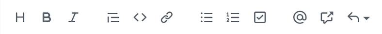
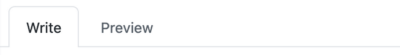
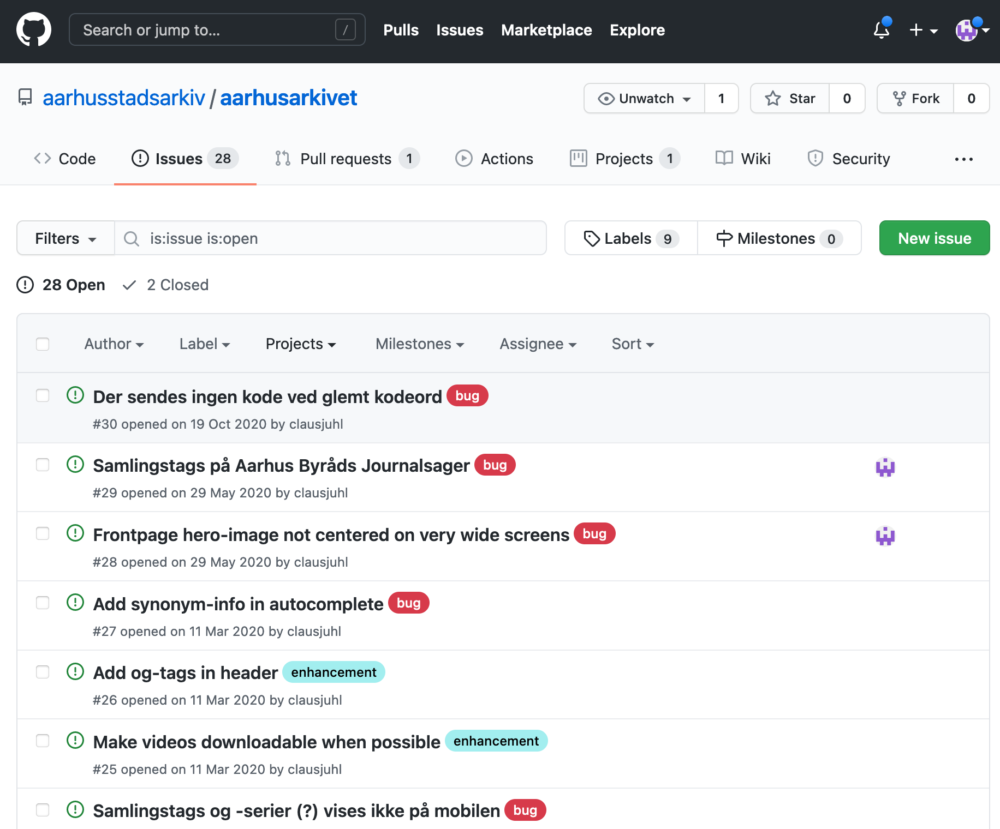

Aarhus Stadsarkiv bruger Github som udviklingsplatform. Det betyder selvfølgelig, at kildekoden til de fleste af vores projekter ligger på Github, men det betyder også, at vi gerne vil have fejlmeldinger, udviklingsønsker m.m. til at ligge sammen med projekterne.

## Oprettelse af Github-konto
For at kunne fejlmelde problemer eller aflevere udviklingsønsker til de projekter, som medarbejderne benytter, skal du være oprettet som bruger af Github og knyttet til vores organisation.

Du kan [oprette dig som bruger her](https:www.github.com/join). Brugernavn og kode, må du frit vælge, men du **skal** bruge din arbejdsmail(...@aarhus.dk).

Når du er oprettet som bruger, skal du meddele en fra it-teamet, at du gerne vil knyttes til Aarhus Stadsarkivs github-organisation.

Processen for fejlmelding og indberetning af udviklingsønsker findes under dokumentationen af de enkelte projekter her på portalen.

## Indberetninger
Indberetninger af fejl, udviklingsønsker, småændringer eller andet foregår ved at oprette såkaldte *issues* på Github-siden for det relevante projekt. Her er en liste over indberetningssider for de "populære" projekter:

- [AarhusArkivet](https://www.github.com/aarhusstadsarkiv/aarhusarkivet/issues/new/choose)
- [SAM](https://www.github.com/aarhusstadsarkiv/sam/issues/new/choose)
- [SAM-workflows](https://www.github.com/aarhusstadsarkiv/sam-workflows/issues/new/choose)
- [AarhusWiki](https://www.github.com/aarhusstadsarkiv/sam-workflows/issues/new/choose)

!!!note "Bemærk"
    Det er ikke alle Stadsarkivets services og værktøjer, der har en Github-side. I disse tilfælde indberettes blot via mail.

!!! note "Bemærk"
    For at oprette issues, skal man være oprettet som bruger af github. [Følg denne vejledning](../inbox/github.md), hvis du ikke allerede er oprettet.

### Vælg indberetning
I de følgende afsnit vises nogle skærmbilleder fra AarhusArkivets issue-sider. Dette er kun medtaget som eksempel, og de enkelte projekters sider kan se anderledes ud.

Når man står på et projekts issue-side, skal man klikke på "Get started" ud for det ønskede skabelon:

Når man har valgt et issue, åbnes en ny side, som skal udfyldes med de relevante informationer, der knytter sig til denne specifikke skabelon. En fejlmeddelelse ser eksempelvis cirka sådan ud:

### Udfyld indberetning
Alle issues skal have en meningsfyldt titel, men herforuden vil der for de enkelte isssue-skabeloner være en række specifikke punkter, som man kan besvare. Ved fejlmeldinger vil vi eksempelvis gerne have beskrevet fejlen, samt angivet hvordan fejlen om muligt kan reproduceres.

!!! note "Bemærk"
    Tekstfeltet, hvori et issue skal beskrives, indeholder allerede noget template-tekst, hvis syntaks kan se lidt ukendt ud. Det hedder **markdown** og er bare en simpel måde, hvorpå man kan arbejde med basale formateringer (fed skrift, links, lister...).
    
    Hvis man er usikker på brugen heraf, bruger man bare den genkendelige værktøjslinje over feltet:

    

    Man kan løbende se, hvordan ens issue kommer til at se ud, ved at klikke på "**Preview**"-fanen:

    

### Gem indberetning
Når man er færdig med sin beskrivelse, trykkes "**Submit new issue**". Indberetningen vil nu være at finde på listen over aktive issues, som er knyttet til AarhusArkivet:

### Statusopdateringer
Når man første gang har gemt en indberetning, bliver man automatisk notificeret via mail omkring enhver ændring til denne indberetning.

### Redigér eksisterende indberetning

### Kommentér indberetning