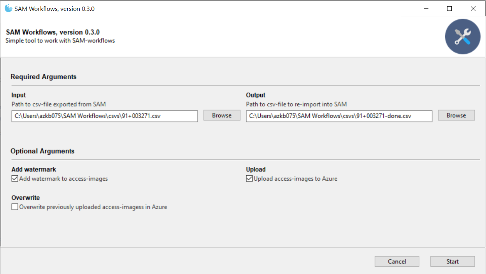

SAM-workflows kan aktuelt generere access-filer (jpg-filer) ud fra pdf-filer eller alle gængse billedformater (jpg, tif, png, gif, JPEG 2000, bmp med flere).

## Kørsel af Workflow
Aktuelt er genereringen af access-filer det eneste workflow, som SAM-workflows indeholder, og man går derfor direkte til brugergrænsefladen for dette workflow:



### Obligatoriske parametre
For at køre dette workflow skal man som minimum angive stien til den csv-fil, som er [eksporteret fra det relevante SAM-job](../sam/export.md) ('**Input**'-parametret), samt hvilken csv-fil resultatet af workflowet skal gemmes i ('**Output**'-parametret).

### Valgfrie parametre
Foruden de obligatoriske parametre, er det muligt at til- eller fravælge følgende tre parameter:

**Add watermark**
:   Ving af, hvis access-filerne skal påføres stadsarkivets vandmærke
    Dette parameter skal almindeligvis sættes.

**Upload**
:   Ving af, hvis access-filerne også skal uploades til stadsarkivets online filserver.
    Hermed får filerne også en online adresse (url), som kan benyttes i registreringerne.
    Dette parameter skal almindeligvis sættes.

**Overwrite**
:   Ving af, hvis access-filerne skal overskrive eventuelle allerede uploadede filer på stadsarkivets online filserver.
    Dette parameter skal sættes, hvis man er sikker på at allerede uploadede filer skal erstattes med disse filer.

## Resultat af workflow
Efter succesrig kørsel af workflowet vil der, alt efter værdien af de enkelte valgfrie parametre, som minimum være genereret følgende:

1. En csv-fil i den valgte '**Output**'-mappe, som skal bruges til at re-importere i SAM, så access-filernes url'er kan tilføjes de relevante registreringer.
2. En eller flere genererede access-filer, placeret i undermapper under **ark_access_store** på stadsarkivets OneDrive-afdelingsdrev. Hvis man eksempelvis har genereret access-filer af et tif-billede med id'et 000277258, vil de relevante access-filer være at finde her:
    ````
    C:\Users\azkb075\Aarhus kommune\AFD-Aarhus Stadsarkiv - Dokumenter\_DIGITALT_ARKIV\ark_access_store\000277258\
    ````
3. Hvis **Upload**-parametret var vinget af, vil de samme access-filer nu også findes i stadsarkivets online filserver:
    ````
    https://acastorage.blob.core.windows.net/sam-access/000277258/000277258_m.jpg
    ````

## Fejl
Der kan opstå en række fejl i forbindelse med genereringen af access-filerne, eks. manglende netværksforbindelse, korrumperede filer med mere. Hvis en fejl stopper kørslen før den er færdig, er det sikkert at starte forfra med workflowet. Send gerne et skræmdump af fejlen til it-teamet, hvis du er i tvivl om hvordan fejlbeskeden skal fortolkes eller ikke kan rette fejlen.

!!! tip
    Undlad at vinge **Overwrite**-parametret af når workflowet køres igen, så kun de resterende filer uploades i anden omgang.
