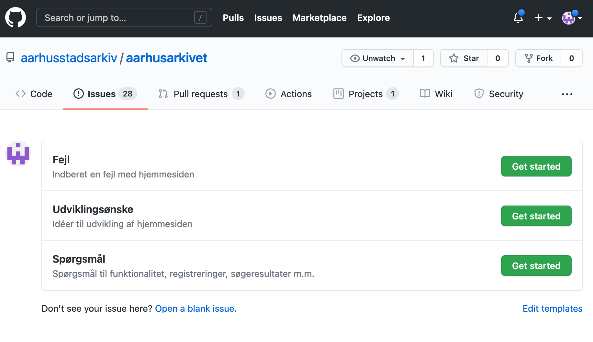
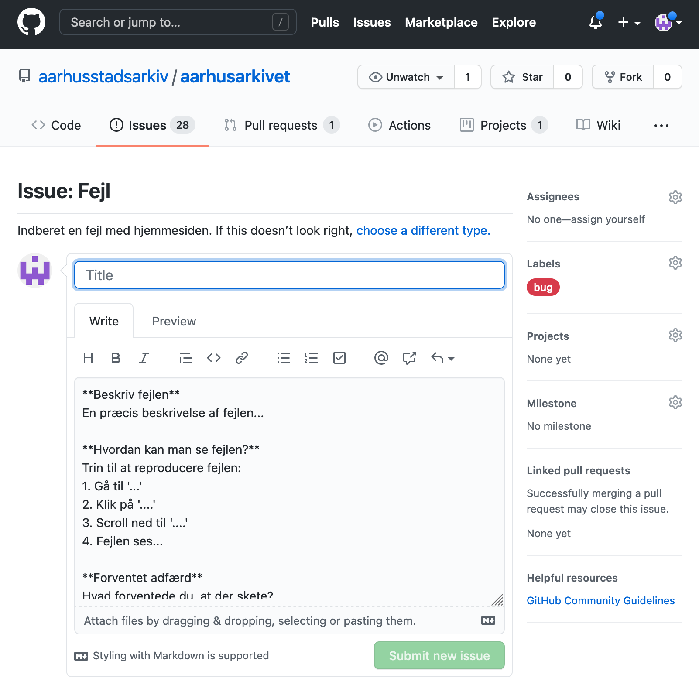
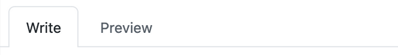
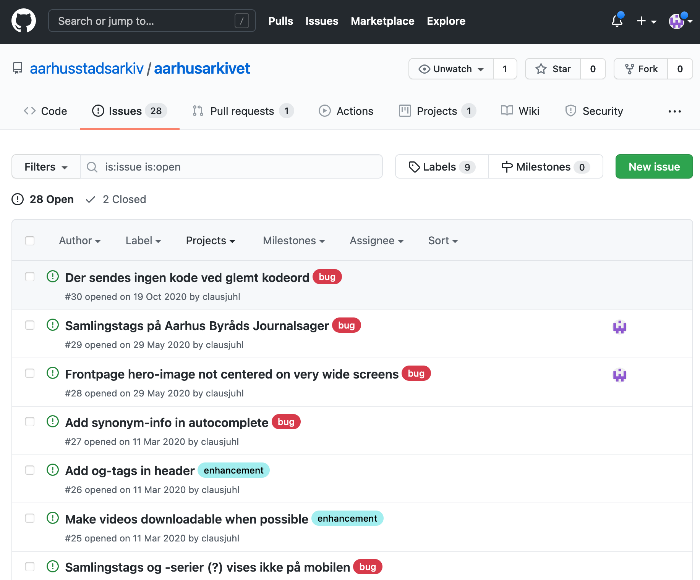

AarhusArkivet er den primære online indgang til vores samlinger.

### Indberetning af fejl, udviklingsønsker m.m.
Indberetninger foregår ved at oprette såkaldte *issues* på [AarhusArkivets github-side](https://www.github.com/aarhusstadsarkiv/aarhusarkivet/issues/new/choose).

!!! note "Bemærk"
    For at oprette issues, skal man være oprettet som bruger af github. [Følg denne vejledning](../inbox/github.md), hvis du ikke allerede er oprettet.

Aktuelt kan du oprette fejlmeldinger, indberette udviklingsønsker eller stille spørgsmål. Klik på "Get started" ud for det ønskede skabelon:

Når man har valgt et issue, åbnes en ny side, som skal udfyldes med de relevante informationer, der knytter sig til denne specifikke skabelon. En fejlmeddelelse ser eksempelvis cirka sådan ud:

Alle issues skal have en meningsfyldt titel, men herforuden vil der for de enkelte isssue-skabeloner være en række specifikke punkter, som man kan besvare. Ved fejlmeldinger vil vi eksempelvis gerne have beskrevet fejlen, samt angivet hvordan fejlen om muligt kan reproduceres.

!!! note "Bemærk"
    Tekstfeltet, hvori et issue skal beskrives, indeholder allerede noget template-tekst, hvis syntaks kan se lidt ukendt ud. Det hedder **markdown** og er bare en simpel måde, hvorpå man kan arbejde med basale formateringer (fed skrift, links, lister...).
    
    Hvis man er usikker på brugen heraf, bruger man bare den genkendelige værktøjslinje over feltet:

    

    Man kan løbende se, hvordan ens issue kommer til at se ud, ved at klikke på "**Preview**"-fanen:

    

Når man er færdig med sin beskrivelse, trykkes "**Submit new issue**". Indberetningen vil nu være at finde på listen over aktive issues, som er knyttet til AarhusArkivet:

### Teknisk information
AarhusArkivet er aktuelt en Flask-applikation uden integreret database, som hostes på Heroku.

Alle kald til backends foregår gennem et api-modul, som videresender requests til følgende services:

- **Auth0**. Authentication
- **DynamoDB** (AWS). Brugerstyring og Authorization
- **Cloudsearch** (AWS). Fuldtekst søgeindeks
- **Oaws** (GCP). Registreringer af materialer og entiteter
- **Aarhusiana** (GCP). Autosuggest

