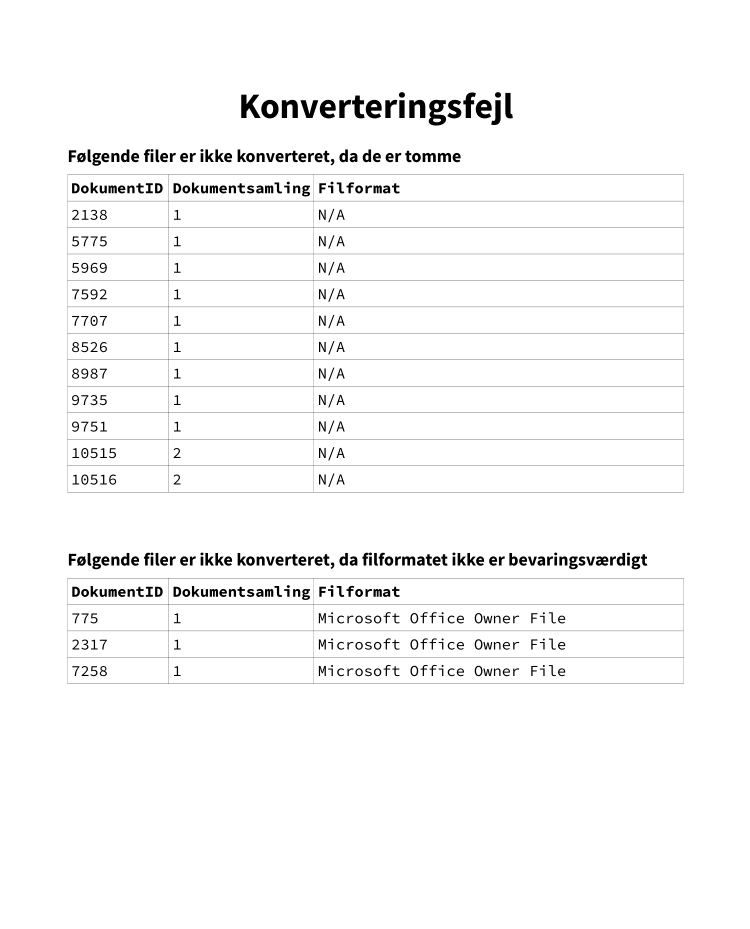

# Convertool

Convertool er en CLI (Command-Line Interface), som benyttes til at konvertere filer, således de overholder Aarhus Stadsarkivs arkiveringskrav. Der læses fra DB-filen produceret af [Digiarch](digiarch.md).

Hvis du skal udvikle på convertool, se da så dokumnetationen som er på convertools GH-repo, under fanen 'wiki´. Her er der guides og tips til hvordan man udvikler med convertool.

## Forudsætninger

### Docker

Convertool kræver at `docker` er installeret, da den kører i en docker container. Den nemmeste måde at tilgå docker på på windows er gennem [docker desktop](https://www.docker.com/products/docker-desktop/).

### Hent convertool billedet ned

Når docker er installeret, skal man havde docker billedet sat up lokalt. Det kan ske på to måder:

Man kan hente docker billedet fra [azure](https://portal.azure.com/#view/Microsoft_Azure_ContainerRegistries/ImageMetadataBlade/registryId/%2Fsubscriptions%2Fa49bde08-179c-407e-a1f9-e89b2429b039%2FresourceGroups%2FAarhusstadsarkiv_core%2Fproviders%2FMicrosoft.ContainerRegistry%2Fregistries%2Facaregistry/repositoryName/convertool/tag/latest) ved følgende kommando

`docker pull acaregistry.azurecr.io/convertool:latest`

Det kan være nødvændigt at logge ind med azure først. For at gøre dette skal du hente [azure CLI](https://learn.microsoft.com/en-us/cli/azure/install-azure-cli), åbne en ny PowerShell og først logge ind ved at skrive `az login`. Der vil så bliver åbnet en browser hvor du vil bliver logget ind på azure automatisk, hvis din browser er logget ind. Derefter skal du linke up til vores registry på azure ved at skrive `az acr login --name acaregistry`. Derefter bør den tidligere kommando for at hente billedet ned fungerer.

Hvis billedet bliver hentet korrekt vil det dukke up under `images` i docker desktop.

### Byg billedet selv

Alternativt kan man også bygge billedet selv. Dette kræver at man har en kopi a `convertool` repositoriet hentet ned på sin maskine. Man kan så åbne en terminal inde i roden af repositoriet, og køre følgende kommandoen:

`docker buildx build -f Dockerfile . -t latest`

Docker vil så bygge et lokalt billede med tagget 'latest'. Det vil også dukke up under images i docker desktop.

## Åben en docker container med convertool billedet til en aflevering

For at begynde at konvetere en aflevering skal man åbne en convertool container, hvor man har mounted den aflevering man gerne vil konveterer ind. den nemmeste måde at gøre dette på er ved at åbne en ny PowerShell terminal i roden af den aflvering man gerne vil arbejde med og køre følgende kommando i en PowerShell terminal:

`docker run -v ${pwd}:/root/handins --it [BILLEDE-ID]`

Denne kommando gør flere ting på en gang, så her er en gennemgang af hvad de forskellige dele af den gør:

- `-v ${pwd}:/root/handins` mounter den directory som ens shell er i lige nu ind i docker containeren som man starter op i folderen `/root/handins` i containeren. Dvs. at selvom containeren køre i sit eget, lukkede miljø, skabes der her en 'åbining' hvor den har direkte adgang til præcis denne mappe, som er lokalt på din egen maskine. De programmer der er i Docker containeren kan så arbejde på data i denne mappe, dvs. afleveringen.
- `--it` er to flag, som fortæller docker at den skal åben en **i**nteractiv
- `BILLEDE-ID` eller `IMAGE-ID` er et unikt ID som docker tildeler ethvert billede. Det kan findes ved at kalde kommandoen `docker image ls`. Kommandoen giver en liste af alle billeder som er lokalt på ens maskine. Alternativt kan man også åbne 'docker desktop', gå under 'images' og i 'name' kollonen er ID'et til bileldet angivet under navnet på bileldet, samt med en genvej til at kopierer det fulde ID til udklipsholderen.

Når kommandoen er kørt vil den åbne terminal være din eneste indgang ind i containeren. Bemærk at hvis du lukker terminallen uden at afslutte containeren med `exit()`, så køre den videre i baggrunden og sluger resourcer. For at lukke den igen skal du åbne docker desktop og finde den under 'containers' her vil den stå som værende kørende, og de kan lukke den herinde.

### Arbejd videre på en tidligere container

Frem for at starte en container op hver dag du skal arbejde på en aflevering, så kan man med fordel bare benytte den container man havde startet op sidste gang. Man kan finde containeren under 'containers' i docker desktop, og kan starte den ved at trykke på 'start' ud fra den. Man kan så, når containeren er startet, klikke på de 3 prikker ud fra den og åbne en terminal enten i 'docker desktop' eller eksternt, som så er i containeren og har de tidligere mapper mounted ind.

Man kan også åbne containeren fra terminalen ved at kalde kommandoen:

`docker start [CONTAINER-ID]`

Hvor [CONTAINER-ID] er det ID som containeren får tildelt af docker når du starter den op første gang. Du kan se det under ´containers´ panellet i docker desktop, eller ved at skrive:

`docker ps -a`

Som lister alle containere, både dem der køre og dem der ikke gør.

## Opbygning af convertool

CLI'en er opbygget som følger.

```powershell
convertool [OPTIONS] [ARGS] [COMMAND] 
```

Argumenter, optioner, og kommandoer er beskrevet i det følgende.

### Argumenter

Convertool har to inputargumenter, som begge er påkrævede: `FILES` og `OUTDIR`. `FILES` skal angive stien til den `files.db` fil, der tidligere i processen er genereret af [Digiarch](digiarch.md), mens `OUTDIR` skal angive stien, hvori de konverterede filer skal gemmes.

!!! hint "Eksempel"
    ```powershell
    convertool D:\filer\AVID.AARS.3.1\_metadata\files.db D:\filer\out [COMMAND]
    ```

Convertool genererer selv en mappe baseret på [AARS-ID'et](../acquisition/acquiring-digital-material.md#identifikator), og det er derfor kun nødvendigt at angive en overordnet folder i `OUTDIR`.

### Optioner

Convertool har 4 optioner. Som udgangspunk ter disse ikke påkrævede, bortset fra option 4, som skal bruges hvis kommandoen (se kommandoer) `replacepdf` kaldes:

1. `--threshold` angiver det maksimale antal fejl, der må ske under konvertering
2. `--help` printer hjælp
3. `--version` printer versionen af Convertool
4. `--pdf_1_7` Angiver at convertool kun skal indlæse PDF 1.7 filer. Denne Option skal bruges sammen med kammandoen `replacepdf` for at konvertere og
                overskrive de PDF 1.7 filer som er tilbage efter første gennemkørsel.

`--threshold` kan bruges, hvis man ønsker, at Convertool accepterer et andet antal fejl end standardværdien. Standardværdien udregnes som kvadratroden af det totale antal filer. Hvis få filer konverteres, kan det være fordelagtigt at sætte `--threshold` til `0`, da konvertering så stopper, første gang en fejl hænder. Det er dog ikke anbefalet for større mængder filer.

!!! hint "Eksempel"
    ```powershell
    convertool --threshold=0 D:\filer\AVID.AARS.3.1\_metadata\files.db D:\filer\out [COMMAND]
    ```

`--help` og `--version` kan som de eneste kaldes *uden* at angive argumenter, da de blot giver information om selve CLI'en.

!!! hint "Eksempel"
    ```powershell
    convertool --help
    convertool --version
    ```

!!! hint "Eksempel"
    ```powershell
    convertool --pdf_1_7=1 D:\filer\AVID.AARS.3.1\_metadata\files.db D:\filer\out replacepdf
    ```

### Kommandoer

Convertool har 3 kommandoer kaldet `main`, `tiff` og `replacepdf`.

- main

Denne kommando konverterer filer til Aarhus Stadsarkivs prædefinerede Master-formater. Disse er blandt andre Open Document Text for alle Word-lignende filer, PDF/A for PDF-filer, og TIFF for billedfiler.

!!! hint "Eksempel"
    ```powershell
    convertool D:\filer\AVID.AARS.3.1\_metadata\files.db D:\filer\out main
    ```

- statutory

Denne kommando konverterer Master-filer til deres arkivformat i overenstemmelse med gældende lovgivning. Syntaksen for at bruge kommandoen er den samme som `main`, hvor `main` erstattes med `statutory`.

- replacepdf


Denne kommando køre funktionen `replace` fra replace_pdf.py på de restederende PDF 1.7 filer som indlæses ved brug af optionen `--pdf_1_7`.
Da funktionen bruger GhostScript, kan den multiprocesses og køre flere konverteringer parallelt. Et eksempel på brugen kan ses under beskrivelsen af `--pdf_1_7`.

## Konvertering

Når Convertool sættes i gang med at konvertere, er der ikke umiddelbart behov for yderligere brugerinput. Konvertering tager i gennemsnit 2s/fil, og det kan derfor være fordelagtigt at have processen kørende i baggrunden, mens man tager sig af andre opgaver.

Under konvertering skrives også til en logfil, `convertool.log`, der kan findes i `_metadata` folderen under `OUTDIR\AARS-ID`.

## Fejlrettelser

Under konvertering kan forskellige fejl opstå. Disse vil typisk ikke stoppe et konverteringsjob, med mindre antallet af fejl overskrider det tilladte. Fejl opdages ved at kigge i `convertool.log`-filen, hvori de vil stå som `WARNING`. Når et job er afsluttet, skrives også en oversigt over antallet af fejl til sidst i log-filen.

!!! hint "Eksempel"
    I det følgende ses et uddrag af en `convertool.log`-fil. Succesfuld konvertering angives med `INFO`, fejl angives med `WARNING`, og til slut ses en oversigt over antal fejl.
    ```log
    2021-02-25 19:25:48 INFO: Starting conversion of file.pdf
    2021-02-25 19:25:55 INFO: Converted file.pdf successfully.
    2021-02-26 09:19:36 WARNING: Failed to convert file.tif: Failed to save file.tif as TIF with error: Error setting from dictionary
    2021-02-25 19:25:55 INFO: Finished conversion of 11438 files with 15 issues, 7 of which were critical.
    ```

Der skelnes mellem kritiske og ikke-kritiske fejl. Ikke-kritiske fejl er typisk timeouts fra LibreOffice -- disse indikerer, at LibreOffice ikke havde tid nok til at konvertere filen, men at filen med al sandsynlighed er velformet, og kan konverteres manuelt. Nogle gange er det også fordelagtigt at give LibreOffice en chance mere, ved at køre konverteringsjobbet igen.

Når filer konverteres manuelt, er det vigtigt at opdatere `_ConvertedFiles`-tabellen, således man bevarer oversigten over, hvilke filer der er konverterede. Dette gøres ved at indsætte den manuelt konverterede fils ID og UUID, som vist i følgende eksempel.

Antag, at en fil med ID `144` og UUID `cd61494b-4547-43e7-97c6-adbafc6e8bd` ikke er konverteret. Den fremgår i `_NotConverted` som følger:

| id    | uuid | path  | aars_path | puid | signature | warning |
| --- | --- | --- | --- | --- | --- | --- |
| 144 | cd61494b-4547-43e7-97c6-adbafc6e8bd | D:\files\AARS.TEST\file.tif | AARS.TEST\file.tif | fmt/335 | Tagged Image File | Filen kunne ikke konveteres |

Til tider kan filer ikke konverteres, fordi de viser sig at være korrupte eller på anden vis fejlbehæftede. Alle filer, der ikke kan eller skal konverteres, skal noteres i et dokument kaldet "Konverteringsfejl", og herudover skal en TIFF-fil, der forklarer den specifikke fejl, bruges som erstatning for den konverterede fil. Disse erstatningsfiler kan findes [her](https://github.com/aarhusstadsarkiv/convertool/tree/master/convertool/core/replacements). Til slut skal dette dokument gemmes som TIFF og fremgå i kontekstdokumentationen. Skabelonen til dokumentet kan findes [her](https://github.com/aarhusstadsarkiv/acadocs/blob/master/files/Konverteringsfejl.odt).

!!! hint "Eksempel"
    Dokumentet "Konverteringsfejl" kan se ud som følger.
    

## Arbejdsgang
TODO
### Convertool quick guide

1. Åbn PowerShell
2. Skriv `cd sti\til\data` f.eks. `cd E:\batch_7\AVID.AARS.61.1`
3. Kør `convertool .\_metadata\files.db OUTDIR main`, hvor `OUTDIR` f.eks. er `E:\batch_7\out`
4. Tjek fildatabasen
5. Tjek logfilen i `_metadata\convertool.log` for `WARNING`s. Ved ikke-kritiske fejl som f.eks. timeout køres convertool igen som i trin 3.
6. Tjek database og logfil igen. Referér til eksemplet i [fejlrettelser](#fejlrettelser), hvis der skal laves manuelle rettelser.
7. Hvis der er filer, som ikke kan konverteres, skal dette noteres i dokumentet "Konverteringsfejl", som beskrevet i [fejlrettelser](#fejlrettelser).
