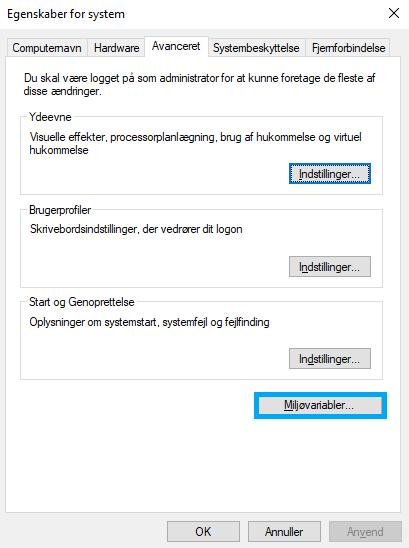
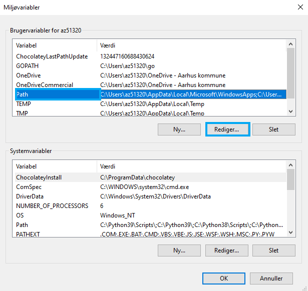
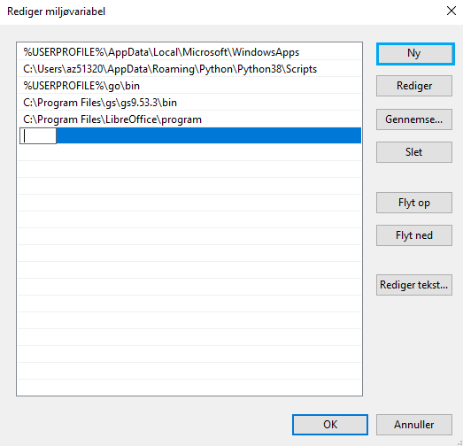

# LibreOffice
LibreOffice er et office-program ligesom Microsoft Office. På Aarhus Stadsarkiv bruges LibreOffice primært til at producere Open Document-versioner af Microsoft Office-filer. 

## Installation
LibreOffice kan installeres via [Chocolatey](chocolatey.md)

```powershell
choco install libreoffice-fresh
```
eller via download af en `.exe`-fil [her](https://www.libreoffice.org/download/download/). 

!!! attention "Husk"
    Chocolatey skal **altid** bruges via en administrativ PowerShell.

## Systemmiljøvariable

Det er nødvendigt at tilføje `program`-folderen i installationslokationen til brugeres `PATH`-miljøvariabel. Den typiske sti er `C:\Program Files\LibreOffice\program`.


Systemmiljøvariable opdateres som følger.

- Find indstillingen "Rediger systemmiljøvariablerne"

    

- Du kommer nu ind i "Egenskaber for system". Tryk her på "Miljøvariabler".

    

- Find `Path` i miljøvariabler og tryk "rediger".
   
   

- Tryk på "Ny" og tilføj den ønskede sti.

    


